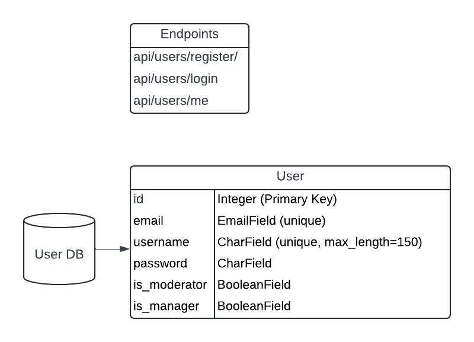

# User Microservice

This is a user management microservice built with Django and Django REST Framework. The microservice includes functionalities for user creation, authentication using JWT, and user management.

## Features

- User registration
- User authentication with JWT
- User profile management
- Admin interface for user management

## Installation

1. Clone the repository:

    ```bash
    git clone <repository-url>
    cd <repository-directory>
    ```

2. Create a virtual environment and activate it:

    ```bash
    python -m venv venv
    source venv/bin/activate  # On Windows, use `venv\Scripts\activate`
    ```

3. Install the required packages:

    ```bash
    pip install -r requirements.txt
    ```

4. Apply migrations:

    ```bash
    python manage.py migrate
    ```

5. Create a superuser for accessing the admin interface:

    ```bash
    python manage.py createsuperuser
    ```

6. Start the development server:

    ```bash
    python manage.py runserver
    ```

## Usage

### Endpoints

#### User Registration

- **Endpoint**: `/api/users/register/`
- **Method**: `POST`
- **Description**: Register a new user.
- **Payload**:

    ```json
    {
      "username": "newuser",
      "email": "newuser@example.com",
      "password": "Password123!"
    }
    ```

#### User Authentication

- **Endpoint**: `/api/users/token/`
- **Method**: `POST`
- **Description**: Obtain JWT tokens for authentication.
- **Payload**:

    ```json
    {
      "username": "existinguser",
      "password": "Password123!"
    }
    ```

#### User Profile Management

- **Endpoint**: `/api/users/me/`
- **Method**: `GET` / `PUT` / `PATCH`
- **Description**: Retrieve or update the authenticated user's profile.
- **Authentication**: Bearer token

### Admin Interface

- **URL**: `/admin/`
- **Description**: Access the Django admin interface to manage users.
- **Authentication**: Superuser credentials

## File Structure

- `models.py`: Contains the user model and custom user manager.
- `admin.py`: Configures the Django admin interface for the user model.
- `serializers.py`: Contains serializers for user registration, authentication, and profile management.
- `views.py`: Defines API views for user registration, authentication, and profile management.
- `urls.py`: Maps URL endpoints to views.

